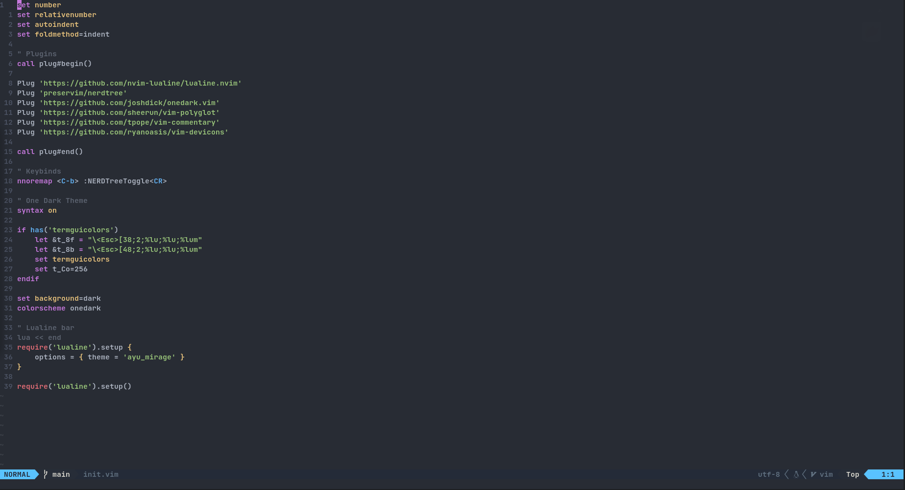
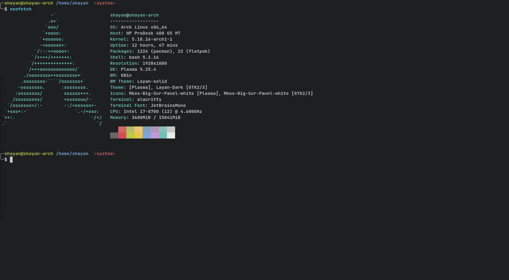

# Table of Contents
- [Installation](#Installation)
	- [Install Script](#Install-Script)
	- [Fonts](#Fonts)
- [Programs](#Programs)
	- [Neo Vim](#nvim) 
	- [alacritty](#alacritty)

# Installation
### Install-Script
This repo also comes with an install script that supports installing the programs and moving the configs.
```
chmod +x install.sh
```
```
./install.sh
```
### Fonts
- [JetBrains Mono Nerd Font](https://github.com/ryanoasis/nerd-fonts/tree/master/patched-fonts/JetBrainsMono/Ligatures)

# Programs
- [Neo Vim](http://neovim.io/)
- [Alacritty](https://github.com/alacritty/alacritty)

### Neo Vim


### alacritty
I am using the fish-shell. The config uses the bash shell. To use your shell you will have to edit the 4th line with the path to your shell in the alacritty.yml file in ~/.config/alacritty. 

