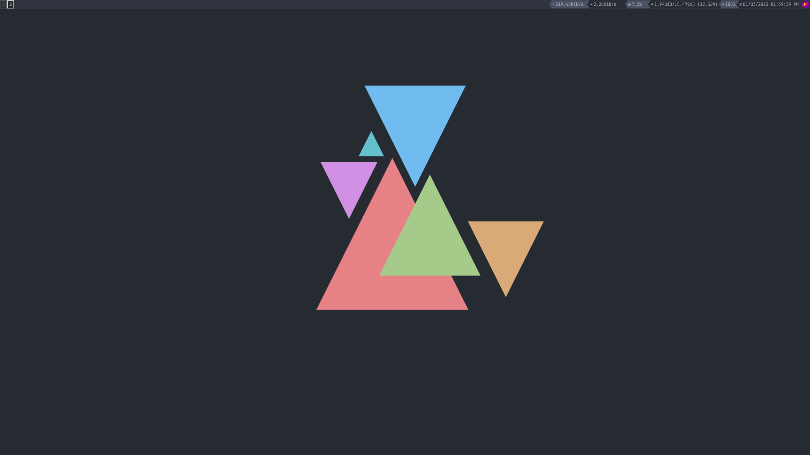

# Vim

# alacritty
I am using the fish-shell. The config uses the bash shell. To use your shell you will have to edit the 4th line with the path to your shell in the alacritty.yml file in ~/.config/alacritty. 

# i3

# Windows Terminal 
